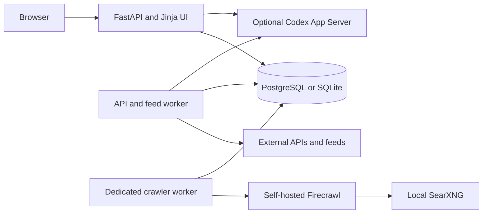

# Jobradar BW

Jobradar BW is a private, self-hosted, single-user application for collecting, scoring, reviewing, and managing executive-assistant and adjacent staff roles. It combines deterministic local scoring with optional Codex analysis while keeping profile data, contact details, CV files, and application state under the operator's control.

This document is intended for the programmer taking over development and operations.

## Handoff summary

The repository contains the complete Jobradar application, database migrations, Docker deployment, background workers, source connectors, Firecrawl integration files, tests, templates, and static assets.

It intentionally does **not** contain:

- production `.env` files or credentials;
- PostgreSQL or SQLite databases;
- database dumps or backups;
- candidate profiles, addresses, CVs, application drafts, or uploaded files;
- live crawl targets or source-specific private configuration;
- Codex login state;
- the Firecrawl upstream checkout, which is fetched at a pinned revision by the installer.

A fresh clone therefore starts as a new, empty deployment.

## Product boundaries

The application is designed around the following constraints:

- One trusted user; there is no application-level login.
- Network reachability is the security boundary. Production binds to `127.0.0.1`.
- Baden-Wuerttemberg full-time direct employment is prioritized.
- Germany-wide fully remote jobs remain visible but lower priority.
- Role relevance and candidate fit are separate, explainable scores.
- Imported PDF or DOCX profile data must be reviewed and confirmed before use.
- Application drafts are versioned and reviewed, but Jobradar never submits applications.
- External retrieval, Firecrawl, Codex, notifications, and automatic discovery remain opt-in.
- Stored domain values are locale-stable; translation happens at the presentation boundary.

## Architecture

Jobradar is a Python 3.12 modular monolith:



Main runtime components:

- `app`: FastAPI, Jinja templates, JSON API, migrations, settings, and UI.
- `worker`: API/feed synchronization, rescoring, availability maintenance, and optional summary precomputation.
- `crawler`: Firecrawl-only synchronization on its own schedule.
- `postgres`: production persistence.
- Firecrawl stack: separate Docker Compose project installed under `infra/firecrawl/upstream/`.

The app, worker, and crawler share synchronous services and the same database. External clients are constructed lazily only after all deployment and database gates pass.

## Repository layout

```text
src/jobradar/
  api.py                    JSON API
  web.py                    server-rendered web routes
  main.py                   application factory and lifespan
  config.py                 environment settings and safe defaults
  models.py                 SQLAlchemy model graph
  domain/                   pure scoring and role rules
  services/                 use cases and transaction coordination
  connectors/               source-specific retrieval and normalization
  integrations/codex/       Codex App Server integration
  templates/                Jinja templates
  static/                   progressive-enhancement JavaScript and CSS
migrations/                 Alembic migrations
infra/firecrawl/            Firecrawl override, SearXNG config, and patches
scripts/server-bootstrap.sh production bootstrap
scripts/install-firecrawl.sh pinned Firecrawl installer
tests/                      domain, service, connector, migration, UI, and security tests
docker-compose.yml          PostgreSQL, app, worker, and crawler
Dockerfile                  production image
AGENTS.md                   detailed engineering and safety rules
```

## Local development

### Requirements

- Python 3.12 or newer
- POSIX shell for the commands below

### Setup

```bash
python3.12 -m venv .venv
.venv/bin/pip install -e ".[dev]"
cp .env.development.example .env
.venv/bin/jobradar init-db
.venv/bin/jobradar seed-demo
.venv/bin/jobradar serve
```

Open `http://127.0.0.1:8080`.

The development configuration uses SQLite and keeps crawling and Codex disabled. Real process environment variables override `.env`; unset inherited production variables such as `DATABASE_URL` before starting an isolated development instance.

Useful commands:

```bash
.venv/bin/jobradar status
.venv/bin/jobradar sync-once
.venv/bin/jobradar sync-once --source ba_jobsuche
.venv/bin/jobradar serve --host 127.0.0.1 --port 8080
```

Do not run `sync-once` against external sources until the deployment and application permissions have been reviewed and enabled.

## Production deployment with Docker

### Requirements

- Linux host
- Docker Engine with the Compose plugin
- Git
- SSH tunnel, private Tailscale access, or a secured reverse proxy for remote access

### First start

```bash
git clone <repository-url> jobradar-bw
cd jobradar-bw
chmod +x scripts/*.sh
./scripts/server-bootstrap.sh
```

On its first run, the script creates `.env`, sets mode `600`, and exits. Edit at least:

```dotenv
APP_SECRET_KEY=<long-random-value>
POSTGRES_PASSWORD=<strong-random-password>
DATABASE_URL=postgresql+psycopg://jobradar:<same-password>@postgres:5432/jobradar
```

Generate random values with a local password manager or, for example:

```bash
openssl rand -hex 32
```

Then run:

```bash
./scripts/server-bootstrap.sh
curl http://127.0.0.1:8080/healthz
```

The bootstrap builds the image, applies migrations, and starts PostgreSQL, the app, the API/feed worker, and the dedicated crawler worker. Default gates keep external retrieval and Codex disabled.

Inspect the deployment with:

```bash
docker compose ps
docker compose logs --tail=100 app worker crawler
curl http://127.0.0.1:8080/api/health
```

### Remote access

Jobradar has no application-level authentication. Keep the listener on loopback and use one of:

- SSH port forwarding;
- private Tailscale Serve;
- a reverse proxy with TLS and authentication.

Never expose PostgreSQL, Firecrawl administration, or Jobradar directly to the public internet.

## Firecrawl and the crawler

Firecrawl is optional and deployed separately from the main Compose project.

### Install

```bash
./scripts/install-firecrawl.sh
```

The first run:

1. fetches the pinned compatible Firecrawl revision;
2. applies the local robots and search-pagination patches;
3. creates `infra/firecrawl/.env` with mode `600`;
4. exits so secrets can be supplied.

Set at least:

```dotenv
BULL_AUTH_KEY=<strong-random-value>
POSTGRES_PASSWORD=<strong-random-value>
```

Run the installer again:

```bash
./scripts/install-firecrawl.sh
```

Firecrawl then listens on host-local port `3002` and is reachable from Jobradar as `http://firecrawl-api:3002` through the external `jobradar_sources` Docker network.

The upstream checkout is ignored by Git. `FIRECRAWL_UPSTREAM_REF` may override the pinned revision, but only change it after confirming that both patches still apply and the integration tests pass.

### Enable retrieval

External work requires layered authorization:

1. Set `CRAWLING_ENABLED=true` in Jobradar `.env`.
2. Keep `FIRECRAWL_ENABLED=true` if Firecrawl should be available.
3. Recreate the app, worker, and crawler containers.
4. Enable API/feed retrieval in the Jobradar Settings page.
5. Separately enable Firecrawl in Settings or Sources.
6. Add explicit public HTTP(S) crawl targets.

Example recreation:

```bash
docker compose up -d --build --force-recreate app worker crawler
```

The main worker polls API/feed sources every six hours by default. The crawler checks Firecrawl targets every two hours. No configured target means no Firecrawl request.

Job portals and company sites are separate target types. BA Jobsuche remains an API source and must not be configured as a Firecrawl target.

The local robots override affects only `robots.txt`; it does not bypass HTTP 403/429 responses, authentication, CAPTCHAs, or legal restrictions. Review permission, retention, attribution, allowlists, and rate limits before adding a target.

## Source connectors

The source layer normalizes records into `RawJobRecord` while preserving the provider payload. It includes:

- BA Jobsuche through its publicly reachable but unofficial application API;
- Arbeitnow, Jobicy, Remotive, Adzuna, and Jooble;
- employer-board integrations such as Greenhouse, Lever, Ashby, SmartRecruiters, Personio, and configured career platforms;
- self-hosted Firecrawl for explicitly configured public targets.

Some source definitions are prepared but require board IDs, employer metadata, or credentials. An empty board list performs no request. Keep unsupported or unconfigured sources disabled rather than allowing recurring failed runs.

Every external connector must retain bounded pagination, timeout and retry policies, canonical URLs, attribution, and unchanged raw provider data.

## Codex integration

Codex is optional and disabled by default. It uses the authenticated Codex App Server, not OpenAI API-key billing.

To include the Codex CLI in the image:

```dotenv
INSTALL_CODEX=true
CODEX_ENABLED=true
```

Rebuild the app and complete device-code authentication from the Jobradar Settings page.

Privacy constraints:

- Codex receives only job content and a confirmed, minimized profile projection.
- Contact details, home addresses, coordinates, raw CV files, and application secrets stay local.
- Job text and generated drafts are untrusted input.
- App-server turns remain read-only.
- Failed review allows at most two evidence-bound automatic revisions.
- Jobradar does not fill forms, upload files, or submit applications.

Local scoring and all core UI functions must continue working when Codex is disabled, disconnected, failing, or quota-limited.

### LLM token and quota usage

Jobradar does not use OpenAI API-key billing and does not calculate a monetary cost per request. Codex runs against the authenticated ChatGPT/Codex account through the App Server. The relevant operational limit is therefore the account's reported plan quota or rate-limit window, not an API invoice generated by Jobradar.

Jobradar currently does not persist or display exact input, output, cached, or reasoning-token counts per turn. The Codex status endpoint reads the App Server's rate-limit data and derives a conservative remaining percentage:

```bash
curl http://127.0.0.1:8080/api/codex/status
```

The main controls are:

```dotenv
CODEX_ENABLED=false
CODEX_MAX_JOBS_PER_RUN=50
CODEX_MIN_REMAINING_PERCENT=20
CODEX_MODEL=
```

- `CODEX_ENABLED=false` prevents all Jobradar-initiated LLM turns.
- `CODEX_MAX_JOBS_PER_RUN` bounds automatic summary candidates and general analysis batches.
- `CODEX_MIN_REMAINING_PERCENT` reserves part of the reported account quota. Before starting a turn, Jobradar refuses the request when the reported remaining percentage is below this threshold.
- `CODEX_MODEL` selects the default model for general Codex operations when set. Automatic job summaries currently use `gpt-5.6-luna` with medium reasoning effort.

The reserve is a guardrail, not exact token accounting. A single large turn can cross the threshold, and the guard cannot be enforced when the App Server does not return a recognizable remaining or used percentage.

Approximate turn behavior:

- A role-title suggestion normally uses one structured turn.
- General job analysis sends up to `CODEX_MAX_JOBS_PER_RUN` jobs in one turn.
- Automatic summaries group at most 20 jobs per turn. With the default limit of 50, a fully pending cycle requires up to three turns.
- Summaries are cached by job content, confirmed profile version, preference version, locale, model, and reasoning effort. Unchanged jobs do not need another summary turn.
- One application draft normally uses one generation turn and one independent review turn. If both permitted automatic revisions are needed, the pipeline can use up to six turns: generation, review, two revisions, and two additional reviews.

Actual token consumption varies with job-description length, the minimized profile projection, requested output size, selected model, and reasoning effort. Application drafting is generally the most expensive path because it produces long documents and may perform repeated reviews.

To reduce usage:

1. Keep Codex disabled unless its features are required.
2. Lower `CODEX_MAX_JOBS_PER_RUN` for smaller automatic batches.
3. Raise `CODEX_MIN_REMAINING_PERCENT` to preserve more account capacity.
4. Prefer cached summaries and avoid unnecessary profile or preference changes that invalidate them.
5. Generate application drafts only for jobs that have passed local scoring and manual review.
6. Monitor the Settings page or `/api/codex/status` before large runs.

## Data and persistence

Production uses PostgreSQL. Local development defaults to SQLite.

Important stored entities include:

- sources and crawl runs;
- normalized job postings and immutable content snapshots;
- deterministic scores and explanations;
- candidate and preference profiles;
- application states and versioned drafts;
- settings and source metadata.

Raw HTML retention defaults to 90 days. Setting `RAW_HTML_RETENTION_DAYS=0` disables raw cleanup.

The repository ignores `.env`, databases, dumps, backups, CV documents, data directories, work directories, and the Firecrawl upstream checkout. Do not weaken those exclusions.

## Backups and updates

Back up PostgreSQL before deployment changes:

```bash
docker compose exec -T postgres \
  pg_dump -U jobradar -d jobradar -Fc > jobradar.dump
```

Store dumps and encrypted `.env` backups outside the repository.

Typical application update:

```bash
git pull --ff-only
docker compose build
docker compose run --rm app jobradar init-db
docker compose up -d
docker compose ps
curl http://127.0.0.1:8080/healthz
```

Update Firecrawl separately with:

```bash
./scripts/install-firecrawl.sh
```

## Verification

Run the project checks from an isolated development environment:

```bash
.venv/bin/pytest
.venv/bin/ruff check .
```

Tests must not contact real portals, Firecrawl, Codex, OpenAI, or other external services. Use injected fakes and `httpx.MockTransport`.

At the time of this handoff, `tests/test_public_connectors.py` still contains known failures involving missing connector imports and Jooble pagination expectations. These do not prevent the application from starting, but they should be resolved before treating the repository as release-clean or adding CI enforcement.

For behavioral changes, also smoke-test the actual CLI or web path. For UI changes, verify the rendered flow in a real browser.

## Security rules for maintainers

- Never commit `.env`, credentials, database dumps, CVs, or personal data.
- Keep production listeners on loopback unless a reviewed authenticated proxy is in place.
- Preserve all deployment and database retrieval gates.
- Do not construct external clients before every gate passes.
- Validate Firecrawl target DNS and every redirect immediately before execution.
- Reject loopback, private, link-local, metadata-service, credential-bearing, and non-HTTP(S) targets.
- Treat provider payloads, fetched job descriptions, and generated text as untrusted.
- Do not add automatic application submission without explicit approval and a dedicated security review.
- Do not silently fall back from Codex to OpenAI API-key billing.

## Takeover checklist

Before assuming operational responsibility:

1. Read `AGENTS.md` completely.
2. Confirm repository visibility and the proprietary license decision.
3. Rotate all deployment, database, Firecrawl, source API, and Codex credentials.
4. Verify backups and perform a restore test.
5. Inspect effective `.env` values without copying secrets into tickets or logs.
6. Confirm Jobradar is reachable only through the intended private access path.
7. Review enabled sources, configured board IDs, Firecrawl targets, and legal permissions.
8. Run migrations, tests, Ruff, and an end-to-end browser smoke test.
9. Check `/api/health`, recent crawl runs, worker logs, stale `running` records, source errors, and job counts.
10. Review candidate/profile privacy boundaries before enabling Codex.
11. Enable external retrieval incrementally, beginning with a small manual run.
12. Decide whether and how to establish CI; none is currently configured.

## License

`pyproject.toml` currently marks the project as **Proprietary**. Sharing the private repository with an authorized maintainer does not make it open source. Decide on ownership, contribution terms, and a public license before changing repository visibility or redistributing the code.
